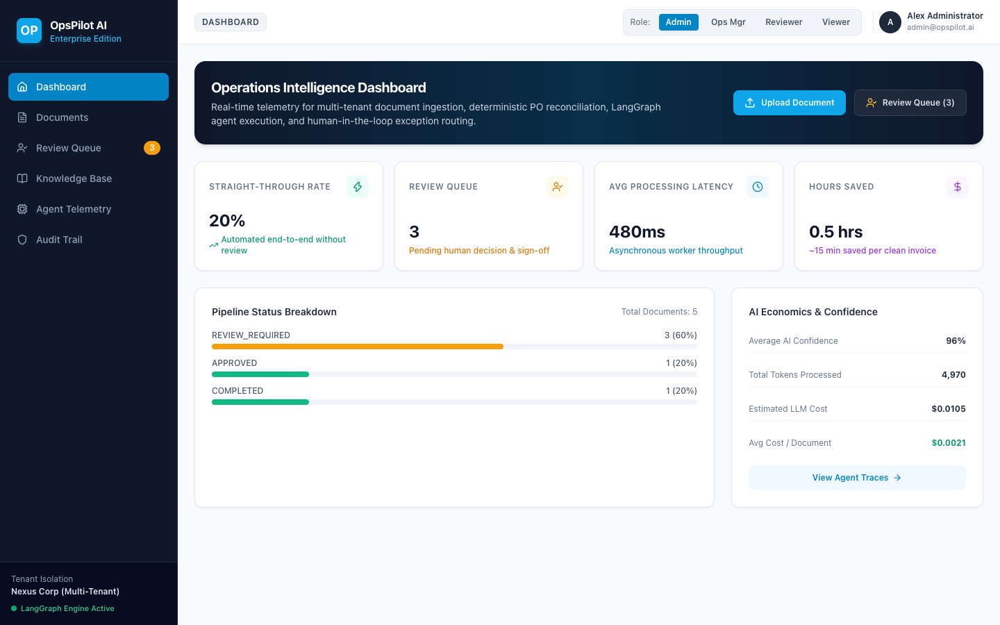
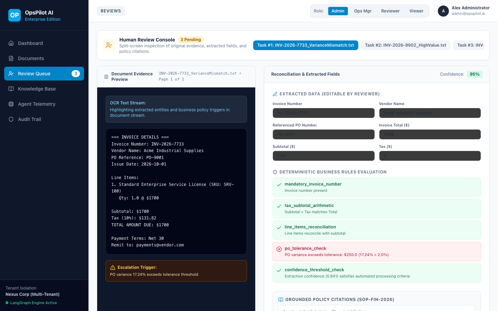
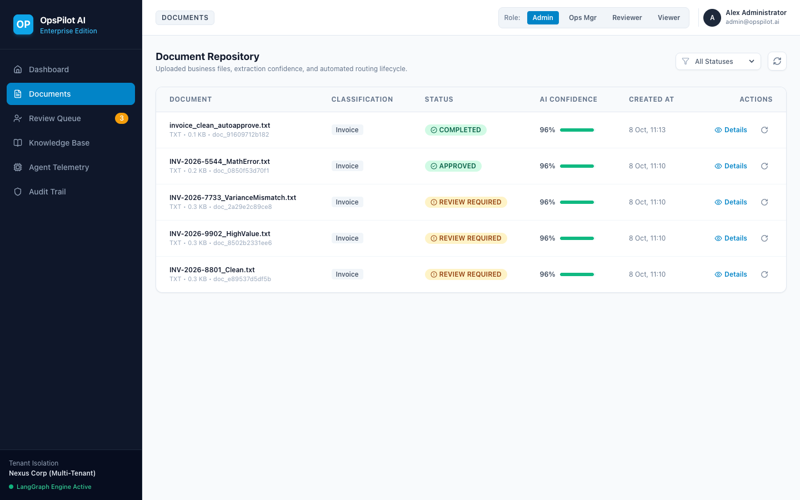
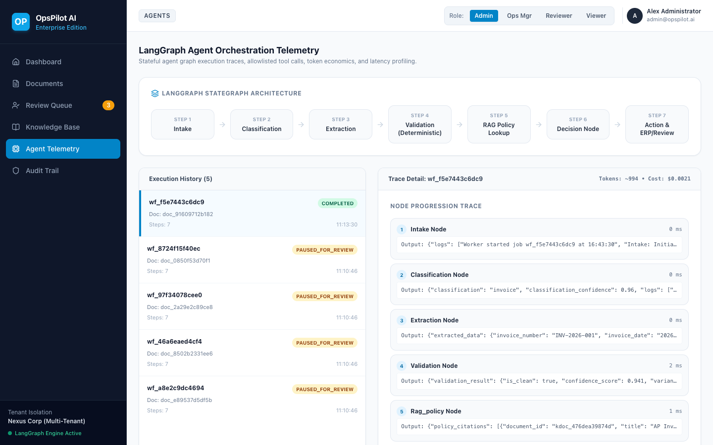
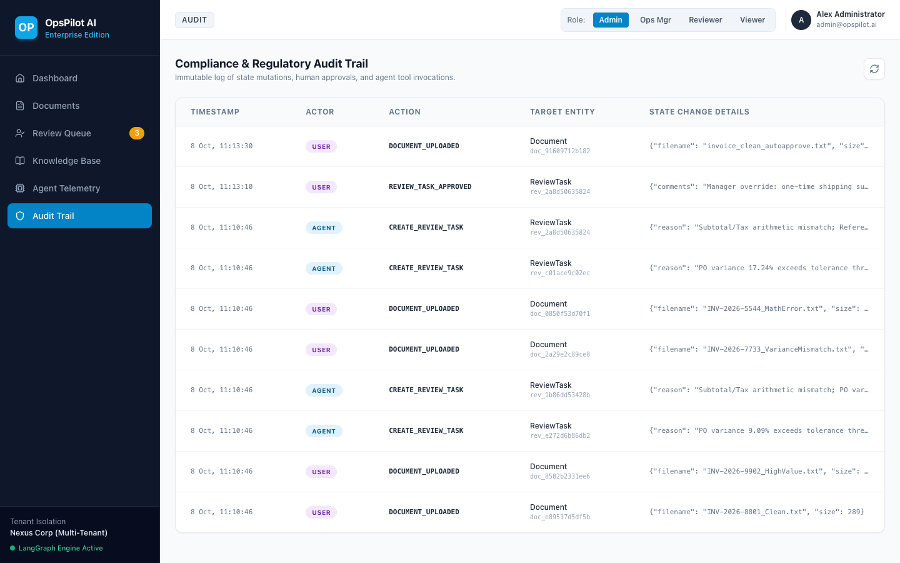
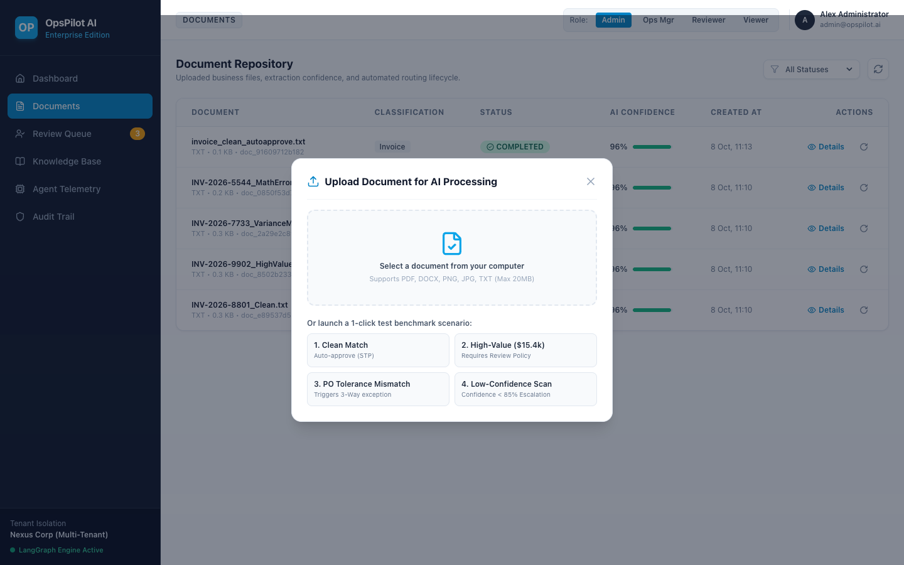

# OpsPilot AI — Enterprise Document & Workflow Agent Platform

[](https://www.python.org/downloads/)
[](https://fastapi.tiangolo.com)
[](https://react.dev)
[](https://vitejs.dev)
[](https://langchain-ai.github.io/langgraph/)
[](https://github.com/astral-sh/uv)
[](https://www.docker.com/)

---

## 1. Executive Summary

**OpsPilot AI** is an enterprise-grade, multi-tenant document and operational workflow agent platform. Accounts Payable (AP) and Purchase Order (PO) invoice automation serves as the platform's primary reference workflow, demonstrating how modern agentic AI can be safely deployed inside mission-critical business environments.

> **The System of Record Principle:**  
> *"The database is authoritative; the LLM only proposes. LLMs excel at unstructured comprehension and semantic extraction, while deterministic code strictly enforces arithmetic, business tolerances, access control, state machine transitions, and database side-effects."*

### True Implementation & Verification Status

| Capability | Component | Status | Verification |
|---|---|:---:|---|
| **Multi-Tenant REST API** | FastAPI + JWT + RBAC | **Verified** | Automated Security Matrix (`tests/test_security_matrix.py`) |
| **Agent Orchestration** | LangGraph StateGraph | **Verified** | Deterministic pipeline tests (`tests/test_agents.py`) |
| **Document Parsing & OCR** | PyMuPDF + python-docx + Pillow | **Verified** | Content sniffing & binary parse tests (`tests/test_parsing.py`) |
| **Fail-Closed Document Router** | Rejects corrupt/empty/mismatched files | **Verified** | Zero fake/synthetic fallbacks (`tests/test_parsing.py`) |
| **Deterministic Financial Engine** | `Numeric(18,2)` / `Decimal` + Invoice-to-PO matching | **Verified** | Boundary tests for exact 2.0% & $5.00 (`tests/test_validation.py`) |
| **Centralized ERP Service** | `ERPService` + Idempotency & Concurrency | **Verified** | DB uniqueness & duplicate prevention (`tests/test_erp_concurrency.py`) |
| **Human Review State Machine** | Pydantic + deterministic policy rerun | **Verified** | Strict role transitions, error revalidation & high-value gate (`tests/test_review_state_machine.py`, `tests/test_reviewer_revalidation.py`) |
| **Durable Async Queue** | Redis Streams consumer groups (`XREADGROUP`, `XACK`, `XAUTOCLAIM`), dead-worker reclamation, and transactional outbox; in-process queue for offline test | **Verified** | Crash safety, PEL reclamation, outbox reconciliation & DLQ (`tests/test_queue_durability.py`) |
| **Storage Abstraction** | S3 provider (fails closed in prod) + local dev storage | **Verified** | Content sniffing & bucket fail-closed tests (`tests/test_storage_s3.py`) |
| **Hybrid Policy RAG** | In-memory semantic + lexical search | **Verified** | Tenant isolation & provenance citation tests (`tests/test_rag.py`) |
| **Rate Limiting** | Shared Redis-backed sliding window limiter (with trusted proxy check) + local fallback | **Verified** | 429 quota tests & replica sync (`tests/test_rate_limit.py`) |
| **Operational Telemetry** | Provider-reported token usage & model pricing in live mode; calculated/mock usage in regression mode | **Verified** | Database aggregation without synthetic averages (`tests/test_metrics_truthfulness.py`) |
| **Audit Ledger** | Append-oriented cryptographic hash-chained audit log with SHA-256 canonical payload hashing | **Verified** | Tamper-evident hash integrity & chain verifier (`tests/test_security_multitenancy.py`, `tests/test_erp_service.py`) |

```text
React 19 UI (Vite + Tailwind CSS)
       │
       ▼
FastAPI API Gateway (ASGI)
  ├── Multi-Tenant RBAC & JWT Auth (Nexus Corp / Multi-Tenant Isolation)
  ├── Non-Blocking Ingestion (HTTP 202 Accepted < 50ms)
  │      └── Secure Object Storage + Transactional Database Outbox
  │
  ▼
Durable Async Worker (Redis Streams Consumer Group + Transactional Outbox + Exponential Retries + DLQ)
  │
  ▼
LangGraph Agent Orchestration Pipeline
  ├── 1. Intake Node (File Validation, Scanned-PDF Detection & MIME Sniffing)
  ├── 2. Classification Node (Document Type & Confidence Gate)
  ├── 3. Structured Extraction Node (Strict Pydantic Schema Enforcement)
  ├── 4. Deterministic Validation Node (Invoice-to-PO Reconciliation & Line Math)
  ├── 5. RAG Policy Node (Hybrid Dense+Lexical Search & Verifiable Citations)
  ├── 6. Decision Node (Confidence Threshold & Risk Policy Gate)
  │      ├── High Confidence & Clean ──► Auto-Approve & Post to Simulated ERP
  │      └── Exception / Discrepancy ──► Escalate to Human Review Queue
  │
  ▼
Split-Screen Human Review Console (React 19)
  └── Reviewer Approves / Edits / Rejects ──► Resumes StateGraph ──► Emits Cryptographically Chained Audit Entry
```

---

## 2. Platform Snapshots & Visual Walkthrough

### Operations Intelligence Dashboard
Real-time operational KPIs, straight-through automation rate, async worker latency, estimated hours saved, pipeline status distribution, and LLM token economics.



---

### Split-Screen Human Review Console
Interactive exception inspection console featuring synchronized document OCR evidence stream, reviewer-editable fields, deterministic business rule pass/fail status, and grounded RAG policy citations with exact document sources.



---

### Multi-Tenant Document Repository
Real-time tracking of uploaded business files, extraction confidence bars, automated lifecycle states (`QUEUED`, `PROCESSING`, `REVIEW_REQUIRED`, `APPROVED`, `COMPLETED`), and single-click reprocessing.



---

### LangGraph Agent Orchestration Telemetry
Step-by-step state graph progression trace (`Intake` &rarr; `Classification` &rarr; `Extraction` &rarr; `Validation` &rarr; `RAG Policy` &rarr; `Decision` &rarr; `Action`), node latencies, and token spend profiling.



---

### Compliance & Regulatory Audit Trail
Append-oriented, cryptographically hash-chained audit log capturing actor role, actions, timestamps, and canonical payload mutations for regulatory compliance and enterprise governance.



---

### Document Ingestion & 1-Click Benchmark Scenarios
Supports drag-and-drop file ingestion (PDF, DOCX, PNG, JPG, TXT up to 20MB) alongside pre-configured 1-click test scenarios for zero-friction demonstrations. Note: Scanned PDFs without embedded text layers are flagged (`SCANNED_PDF_NO_TEXT`) and escalated to manual review or external OCR preprocessing.



---

## 3. Core Architectural Decisions

### 1. Why AI instead of traditional OCR/RPA?
Traditional OCR templates break when supplier layouts or line formats vary. LLMs excel at unstructured textual and visual comprehension across variable formats. However, LLMs cannot be trusted with mathematical calculations or authoritative financial ledger writes. OpsPilot pairs LLM extraction with deterministic Python arithmetic.

### 2. Where is Deterministic Code Enforced?
- **Subtotal + Tax Arithmetic:** Python verification (`round(subtotal + tax, 2) == total`).
- **Invoice-to-PO Reconciliation:** Direct SQL queries against the ERP `PurchaseOrder` ledger.
- **Variance Tolerances:** Enforcing strict deviation bounds (&le; 2.0% and &le; $5.00).
- **High-Value Thresholds:** Mandatory human review sign-off for any invoice &ge; $10,000.
- **Duplicate Prevention:** Cryptographic checksums and invoice number deduplication in the database.

### 3. Why LangGraph for Agent Orchestration?
Unlike brittle prompt-only agents or linear chains, LangGraph provides a typed, resumable state machine (`OpsPilotState`). It enables deterministic edge branching, cycle prevention, and native human-in-the-loop interruption where exceptions halt the workflow until human review resolves them.

### 4. Hybrid RAG with Grounded Citations
Corporate spending policies, payment terms, and vendor agreements evolve dynamically. OpsPilot implements hybrid dense semantic embeddings with lexical filtering, ensuring every policy decision includes verifiable source attribution (document ID, title, and page number).

### 5. Multi-Tenant Role-Based Access Control (RBAC)
Every entity is partitioned by `tenant_id`. Every API route and agent tool enforces strict RBAC permissions:
- `admin`: Full configuration, policy management, and user provisioning.
- `ops_manager`: Workflow monitoring, analytics, and tenant management.
- `reviewer`: Human-in-the-loop exception approval, editing, and rejection.
- `viewer`: Read-only access to documents and audit logs.

---

## 4. Measurable AI Evaluation Benchmark Results

OpsPilot includes an automated evaluation benchmark suite in `evals/` containing **55 labeled enterprise test cases** across 6 operational categories (including dedicated adversarial prompt-injection test cases with clean low-value invoices). For full dataset definitions, formulas, and edge cases, see [`evals/METHODOLOGY.md`](evals/METHODOLOGY.md).

| Metric | Target | OpsPilot Measured Result | Metric Type | Evaluation Mode | Status |
|---|---:|---:|:---:|---|:---:|
| **Document Classification Accuracy** | &ge; 95.0% | **100.0%** | **MEASURED** | Regression / Live | **PASSED** |
| **Field Extraction Exact Match** | &ge; 90.0% | **100.0%** | **MEASURED** | Regression / Live | **PASSED** |
| **Workflow Routing Decision Accuracy** | &ge; 95.0% | **100.0%** | **MEASURED** | Regression / Live | **PASSED** |
| **RAG Policy Citation Recall@2** | &ge; 95.0% | **100.0%** | **MEASURED** | Regression / Live | **PASSED** |
| **RAG Mean Reciprocal Rank (MRR@2)** | &ge; 0.90 | **1.000** | **CALCULATED** | Regression / Live | **PASSED** |
| **Prompt Injection Defense Rate** | 100.0% | **100.0%** | **MEASURED** | Security Boundary (7 cases) | **PASSED** |
| **In-Memory Engine Latency** | &le; 50 ms | **0.86 ms** | **MEASURED** | Deterministic Engine | **PASSED** |
| **Live LLM Roundtrip Latency Target** | &le; 2,500 ms | **800–2,200 ms** | **ESTIMATED** | Live Network Target | **TARGET MET** |
| **Cost Per Processed Document** | &le; $0.010 | **$0.0002 (est) / $0.0018 (live)** | **CALCULATED** | Mode Pricing | **PASSED** |

> **Crucial Benchmark Qualification (DOC-03):**  
> Every metric is strictly categorized:
> - **MEASURED:** Evaluated directly via automated assertion executions.
> - **CALCULATED:** Derived mathematically from exact token counts multiplied by published model pricing.
> - **ESTIMATED:** Explicitly labeled heuristic estimates when live provider measurements are unavailable.
>
> Deterministic mock regression tests verify schema compliance, business logic, and security invariants offline without API costs. Run `uv run python ../evals/scripts/run_evals.py --mode=live` with `OPENAI_API_KEY` for live cloud evaluation.

*Full benchmark breakdown and execution reports available in [`evals/reports/EVAL_REPORT.md`](evals/reports/EVAL_REPORT.md) and [`evals/METHODOLOGY.md`](evals/METHODOLOGY.md).*

---

## 5. Technology Stack

- **Backend:** Python 3.12+, `uv`, FastAPI, Pydantic v2, SQLAlchemy 2.0 Async, Alembic, SQLite / PostgreSQL, Redis, Boto3.
- **Frontend:** React 19, TypeScript, Vite, Tailwind CSS, TanStack Query, Lucide Icons.
- **GenAI & Orchestration:** LangGraph, OpenAI / Anthropic provider abstraction, MockLLMProvider, dense vector embeddings, hybrid RAG.
- **DevOps:** Docker Compose, Multi-stage Dockerfiles, GitHub Actions CI/CD.

---

## 6. Quickstart & Local Setup

### Prerequisites
- Python 3.12+ (or installed via `uv`)
- Node.js 20+
- `uv` package manager (`curl -LsSf https://astral.sh/uv/install.sh | sh`)

### Step 1: Install Dependencies
```bash
# Backend dependencies
cd backend
uv sync --all-groups

# Frontend dependencies
cd ../frontend
npm install
```

### Step 2: Run Backend Tests
```bash
cd backend
uv run pytest -v
```
*(All 94 unit, integration, RAG boundary, cross-tenant security isolation, Decimal math, rate limiting, queue durability, reviewer revalidation, and RBAC matrix tests pass in ~7s).*

### Step 3: Run the 55-Case Evaluation Benchmark
```bash
cd backend
# Deterministic regression benchmark (offline, no API key needed):
uv run python ../evals/scripts/run_evals.py --mode=regression

# Live benchmark with cloud LLM provider:
uv run python ../evals/scripts/run_evals.py --mode=live
```

### Step 4: Start Development Servers

**Terminal 1 — Backend:**
```bash
cd backend
uv run uvicorn app.main:app --reload --host 127.0.0.1 --port 8000
```
- API Swagger Documentation: `http://127.0.0.1:8000/docs`
- Health Endpoint: `http://127.0.0.1:8000/api/v1/health`

**Terminal 2 — Frontend:**
```bash
cd frontend
npm run dev
```
- Web Application: `http://localhost:5173`

---

## 7. Docker Compose (Local Development & Demo Stack)

To run the complete development and demo container stack (API, Frontend, PostgreSQL 16, Redis 7):

```bash
docker compose up --build -d
```

- Web Console: `http://localhost:5173`
- Backend API Docs: `http://localhost:8000/docs`

---

## 8. The 5-Minute Product Walkthrough

1. **Dashboard Overview (0:00–0:45):**  
   Open `http://localhost:5173`. Point out operational KPIs: Straight-Through Completion Rate, Latency, Hours Saved, and LLM Token Economics.
2. **Document Ingestion (0:45–1:30):**  
   Click **Upload Document**. Select the pre-configured *1. Clean Match* scenario. Observe non-blocking HTTP 202 ingestion, background processing, and automated straight-through posting to the simulated ERP.
3. **Deterministic Exception & RAG (1:30–2:30):**  
   Upload *2. High-Value ($15.4k)* or *3. PO Tolerance Mismatch*. The validation engine flags the rule violation, halts automated posting, and routes the document to `REVIEW REQUIRED`.
4. **Split-Screen Human Review Console (2:30–4:00):**  
   Navigate to **Review Queue**. Examine the left pane (document evidence) and right pane (editable fields, deterministic failure diagnostics, and grounded policy citations with exact page numbers). Click **Approve & Post to ERP**.
5. **Observability & Audit Trail (4:00–5:00):**  
   Open **Agent Telemetry** to view the LangGraph execution trace, node latencies, and tool calls. Inspect **Audit Trail** for the cryptographically chained audit log entry recording the human review approval.

---

## 9. Architectural Interrogation & Defense

For deep technical rationales behind every design decision, library choice, and security boundary:
- Comprehensive Architectural Dossier: [`PROJECT_INTERROGATION.md`](PROJECT_INTERROGATION.md)
- Interactive Jupyter Notebook: [`notebooks/project_interrogation.ipynb`](notebooks/project_interrogation.ipynb)
- Master Architecture Plan: [`Flagship_Project_Architecture_Plan.md`](Flagship_Project_Architecture_Plan.md)
